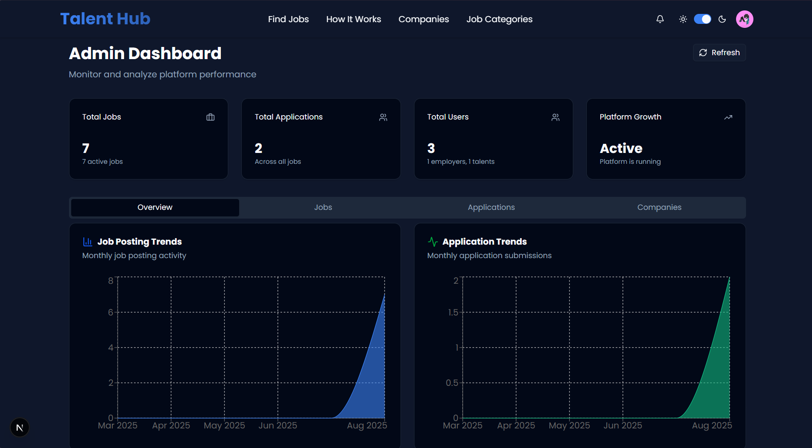
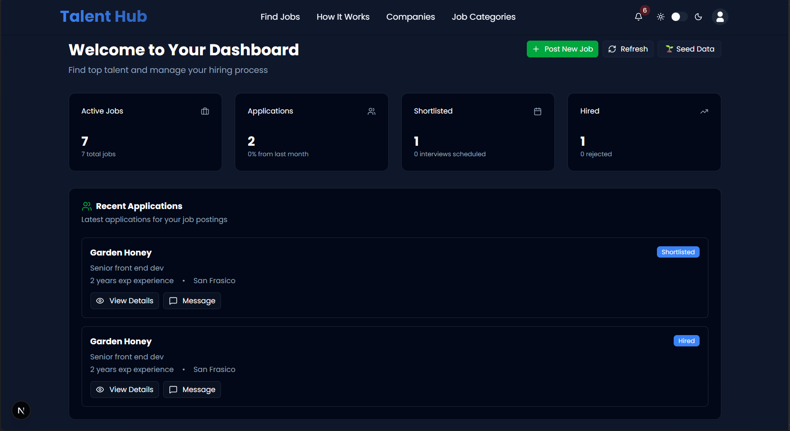
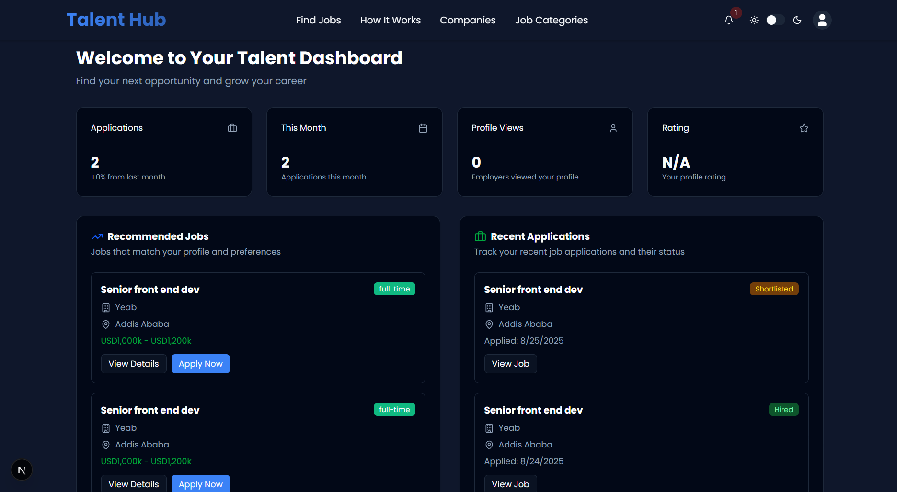

# TalentHub - Modern Job Portal Platform

A comprehensive, full-stack job portal platform built with Next.js 15, TypeScript, and MongoDB. TalentHub connects talented developers with innovative companies through an intuitive, feature-rich platform with role-based access control, real-time notifications, and professional dashboards.

## 🚀 Live Demo

**Frontend**: [https://talent-hub.vercel.app](https://talent-hub.vercel.app)

## ✨ Key Features

### 🎯 **For Job Seekers (Talent)**

- **Smart Job Discovery**: Advanced search with filters for location, type, experience level, and salary
- **One-Click Applications**: Streamlined application process with resume upload and cover letter
- **Application Tracking**: Real-time status updates and comprehensive application history
- **Personal Dashboard**: Analytics, recommended jobs, and profile insights
- **Professional Profile**: Skills showcase, experience highlights, and portfolio management

### 🏢 **For Employers**

- **Job Management**: Create, edit, and manage job postings with rich descriptions
- **Application Pipeline**: Review, shortlist, and manage candidates through the hiring process
- **Company Profile**: Professional company branding and information management
- **Analytics Dashboard**: Comprehensive insights into job performance and candidate quality
- **Candidate Communication**: Direct messaging and interview scheduling tools

### 👨‍💼 **For Administrators**

- **System Overview**: Complete platform analytics and user management
- **Content Moderation**: Job and application quality control
- **User Management**: Role management and account oversight
- **Platform Analytics**: System-wide performance metrics and insights

### 🌟 **Platform Features**

- **Responsive Design**: Mobile-first approach with seamless cross-device experience
- **Dark/Light Themes**: Beautiful theme switching with system preference detection
- **Real-time Notifications**: Instant updates for applications, messages, and status changes
- **File Management**: Secure resume uploads and document handling
- **Advanced Search**: AI-powered job matching and intelligent recommendations
- **Performance Optimized**: Built with Next.js 15 and optimized for speed
- **Google Auth with Better Auth**: Auth with better auth library

## 🖥️ Dashboard Previews

### 👨‍💼 Admin Dashboard


_Complete system overview with analytics, user management, and platform monitoring_

### 🏢 Employer Dashboard


_Job management, application pipeline, and company analytics_

### 🎯 Talent Dashboard


_Application tracking, job recommendations, and personal insights_

## 🛠️ Technology Stack

### **Frontend**

- **Framework**: Next.js 15 with App Router
- **Language**: TypeScript 5
- **UI Library**: React 19 with modern hooks
- **Styling**: Tailwind CSS v4 with custom design system
- **File upload**: Uploadthing to store resume online
- **Components**: shadcn/ui with Radix UI primitives
- **Animations**: Framer Motion for smooth interactions
- **Icons**: Lucide React & Tabler Icons

### **Backend**

- **Runtime**: Next.js API Routes
- **Database**: MongoDB with Mongoose ODM
- **Authentication**: Better Auth with session management
- **File Storage**: UploadThing for secure file handling
- **Email Service**: Resend for transactional emails
- **Validation**: Built-in TypeScript validation

### **Infrastructure**

- **Hosting**: Vercel (Frontend) + Render (Backend)
- **Database**: MongoDB Atlas
- **CDN**: Vercel Edge Network
- **Monitoring**: Built-in error tracking and logging

## 🚀 Quick Start

### Prerequisites

- Node.js 18+
- MongoDB database
- npm or yarn package manager

### Installation

1. **Clone the repository**

```bash
git clone https://github.com/yourusername/talent-hub.git
cd talent-hub
```

2. **Install dependencies**

```bash
npm install
```

3. **Environment Setup**
   Create a `.env.local` file:

```env
# Database
MONGODB_URI=

# Authentication
AUTH_SECRET=your-super-secret-auth-key-here
AUTH_URL=http://localhost:3000

# File Upload
UPLOADTHING_SECRET=your_uploadthing_secret_key
UPLOADTHING_APP_ID=your_uploadthing_app_id

# Email Service (Optional)
RESEND_API_KEY=your_resend_api_key
```

4. **Start development server**

```bash
npm run dev
```

5. **Open your browser**
   Navigate to [http://localhost:3000](http://localhost:3000)

## 📁 Project Architecture

```
talent-hub/
├── src/
│   ├── app/                    # Next.js App Router
│   │   ├── (auth)/            # Authentication routes
│   │   │   ├── login/         # User login
│   │   │   ├── signup/        # User registration
│   │   │   ├── forget-password/ # Password recovery
│   │   │   └── reset-password/  # Password reset
│   │   ├── api/               # REST API endpoints
│   │   │   ├── jobs/          # Job management
│   │   │   ├── applications/  # Application handling
│   │   │   ├── employer/      # Employer-specific APIs
│   │   │   ├── talent/        # Talent-specific APIs
│   │   │   ├── admin/         # Admin APIs
│   │   │   ├── notifications/ # Notification system
│   │   │   └── uploadthing/   # File upload handling
│   │   ├── dashboard/         # Role-based dashboards
│   │   │   ├── admin/         # Admin dashboard
│   │   │   ├── employer/      # Employer dashboard
│   │   │   └── talent/        # Talent dashboard
│   │   ├── jobs/              # Job browsing and details
│   │   └── onboarding/        # User onboarding flow
│   ├── components/            # React components
│   │   ├── ui/                # shadcn/ui components
│   │   ├── auth/              # Authentication components
│   │   ├── dashboard/         # Dashboard components
│   │   └── shared/            # Reusable components
│   ├── hooks/                 # Custom React hooks
│   ├── lib/                   # Utility libraries
│   │   ├── auth/              # Authentication logic
│   │   ├── db.ts              # Database connection
│   │   └── utils.ts           # Helper functions
│   ├── models/                # MongoDB schemas
│   └── utils/                 # Additional utilities
├── public/                    # Static assets
├── tailwind.config.js         # Tailwind configuration
└── next.config.ts            # Next.js configuration
```

## 🔌 API Overview

TalentHub provides a comprehensive REST API with the following main endpoints:

- **Authentication**: `/api/auth/*` - User registration, login, and session management
- **Jobs**: `/api/jobs/*` - Job CRUD operations and search
- **Applications**: `/api/applications/*` - Job application management
- **Employer**: `/api/employer/*` - Employer-specific operations
- **applicant**: `/api/talent/*` - Applicant-specific operations
- **Admin**: `/api/admin/*` - Administrative functions
- **Notifications**: `/api/notifications/*` - Real-time notification system
- **File Upload**: `/api/uploadthing/*` - Secure file handling

For detailed API documentation, see [API_DOCUMENTATION.md](./API_DOCUMENTATION.md)

## 🗄️ Data Models

### **User Model**

- Authentication credentials and profile information
- Role-based access control (user, employer, admin)
- Company profile for employers
- Onboarding status and preferences

### **Job Model**

- Comprehensive job details and requirements
- Company information and branding
- Salary ranges and benefits
- Application tracking and status management

### **Application Model**

- Job application details and status
- Candidate information and skills
- Resume and cover letter attachments
- Interview notes and feedback

### **Notification Model**

- Real-time system notifications
- User-specific alerts and updates
- Read status and delivery tracking

## 🎨 Design System

TalentHub features a modern, accessible design system built with:

- **Color Palette**: Semantic color tokens for dark/light themes
- **Typography**: Consistent font hierarchy and spacing
- **Components**: Reusable UI components with variants
- **Animations**: Smooth transitions and micro-interactions
- **Responsiveness**: Mobile-first responsive design

## 🔐 Security Features

- **Authentication**: Secure session-based authentication
- **Authorization**: Role-based access control (RBAC)
- **Data Validation**: Input sanitization and validation
- **File Security**: Secure file uploads with type validation
- **API Protection**: Rate limiting and request validation
- **HTTPS**: Secure communication protocols

## 📱 Responsive Design

- **Mobile-First**: Optimized for mobile devices
- **Breakpoint System**: Responsive layouts for all screen sizes
- **Touch-Friendly**: Optimized touch interactions
- **Performance**: Fast loading and smooth animations

## 🚀 Deployment

### **Frontend (Vercel)**

```bash
npm run build
# Deploy to Vercel with automatic CI/CD
```

### **Backend (Render/Heroku)**

- Set environment variables
- Connect MongoDB database
- Deploy API routes

### **Environment Variables**

Ensure all required environment variables are set in your deployment platform.

## 🧪 Testing & Development

### **Development Workflow**

1. Start development server: `npm run dev`
2. Seed database: Visit `/api/seed` (development only)
3. Test user flows and API endpoints
4. Use browser dev tools for debugging

### **Testing Scenarios**

- User registration and authentication
- Job posting and management
- Application submission and tracking
- Dashboard functionality
- File uploads and management
- Notification system

## 🤝 Contributing

We welcome contributions! Please follow these steps:

1. **Fork** the repository
2. **Create** a feature branch (`git checkout -b feature/amazing-feature`)
3. **Commit** your changes (`git commit -m 'Add amazing feature'`)
4. **Push** to the branch (`git push origin feature/amazing-feature`)
5. **Open** a Pull Request

### **Development Guidelines**

- Follow TypeScript best practices
- Use conventional commit messages
- Ensure responsive design compatibility
- Test across different devices and browsers
- Maintain accessibility standards

## 📄 License

This project is licensed under the MIT License - see the [LICENSE](LICENSE) file for details.

## 🆘 Support & Community

- **Documentation**: [API Documentation](./API_DOCUMENTATION.md)
- **Issues**: [GitHub Issues](https://github.com/yourusername/talent-hub/issues)
- **Discussions**: [GitHub Discussions](https://github.com/yourusername/talent-hub/discussions)
- **Email**: support@talenthub.com

## 🙏 Acknowledgments

- **Next.js Team** for the amazing framework
- **Vercel** for hosting and deployment
- **shadcn/ui** for beautiful components
- **Better Auth** for authentication
- **MongoDB** for the database solution

---

**TalentHub** - Connecting Talent with Opportunity 🚀

_Built with ❤️ using Next.js, TypeScript, and MongoDB_
